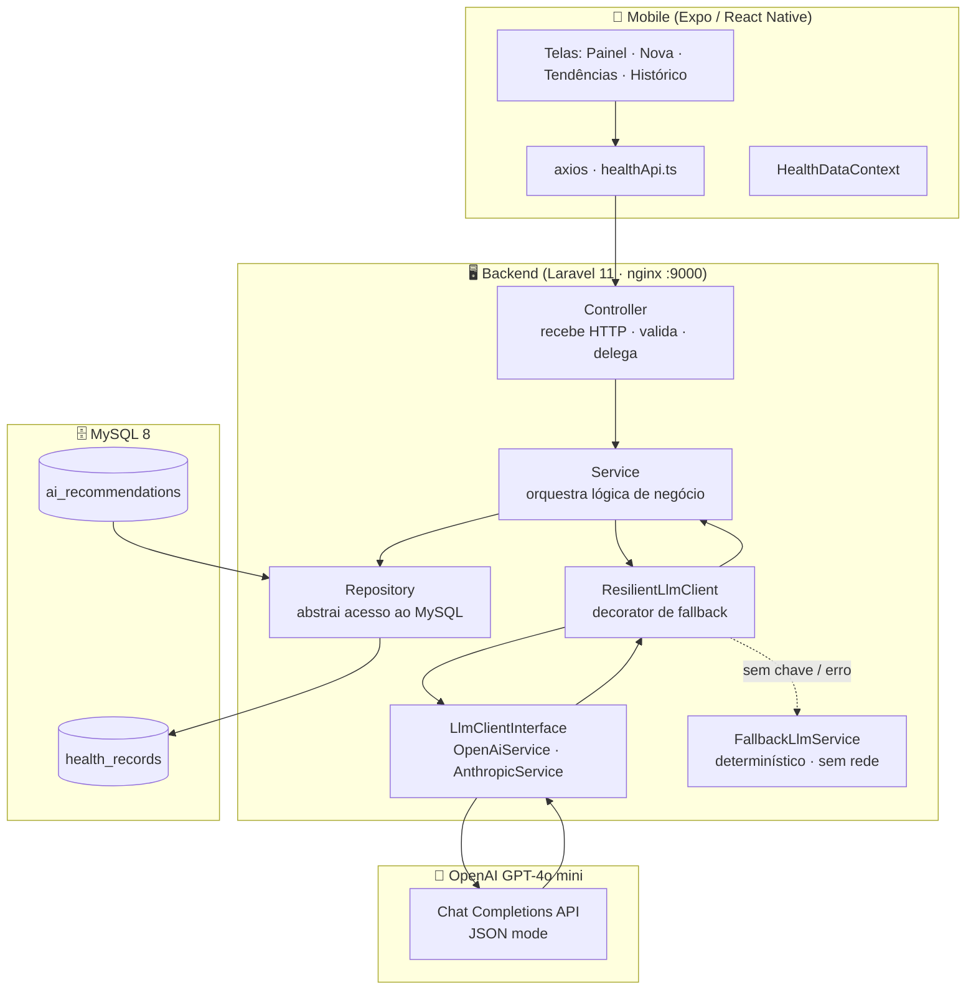

# 🩺 Health Dashboard MVP

> Aplicativo mobile de acompanhamento de saúde com análise de biomarcadores via IA — entregue em 48h como desafio técnico para a **Tecsa Group**.

---

## Visão Geral

Acompanhar a própria saúde é difícil porque os dados existem, mas a interpretação é escassa. O **Health Dashboard MVP** resolve isso: o usuário registra três biomarcadores diários (sono, glicose e HRV), e o backend processa esses dados através de uma API de linguagem natural que devolve recomendações práticas de hábitos — sem diagnósticos, sem jargão clínico.

A solução é um monorepo com backend **Laravel 11** em arquitetura em camadas (Controller → Service → Repository) totalmente containerizado, consumido por um app **Expo (React Native + TypeScript)**. A integração com IA é provider-agnóstica — hoje usa **OpenAI (GPT-4o mini)** por disponibilidade de chave, mas trocar para Anthropic Claude ou qualquer outro provedor exige apenas uma linha no `.env` (`LLM_PROVIDER=anthropic`), graças ao padrão de Inversão de Dependência aplicado na camada de integração.

O diferencial implementado é a **Análise de Tendência Temporal**: quando o usuário acumula 3 ou mais registros, o backend calcula deterministicamente os deltas, médias e direção de variação de cada biomarcador em PHP — e entrega esses dados pré-processados à IA para interpretação. Isso elimina alucinação numérica (a IA nunca faz aritmética) e demonstra separação real entre cálculo determinístico e inferência generativa.

---

## Stack

| Camada | Tecnologia |
|---|---|
| Mobile | Expo SDK 54 · React Native 0.81 · TypeScript |
| Backend | Laravel 11.54 · PHP 8.3 · nginx |
| Banco de dados | MySQL 8 |
| IA | OpenAI GPT-4o mini (provider-agnóstico via `LlmClientInterface` — ver nota abaixo) |
| Containerização | Docker · docker-compose |
| Testes | PHPUnit 11 · Mockery |

---

## Setup em 1 comando

### Pré-requisitos
- [Docker Desktop](https://www.docker.com/products/docker-desktop/) instalado e rodando
- Git

### Subindo o ambiente

```bash
git clone <URL_DO_REPOSITÓRIO>
cd health-dashboard-mvp

# Copie o .env de exemplo e adicione sua chave de API
cp backend/.env.example backend/.env
# Edite backend/.env e preencha: OPENAI_API_KEY=sua-chave-aqui

docker compose up
```

> Isso sobe automaticamente: **PHP 8.3-FPM + nginx (porta 9000)**, **MySQL 8** e **phpMyAdmin (porta 8080)**. O entrypoint aguarda o banco ficar saudável, gera a `APP_KEY`, roda as migrations e inicia o php-fpm. Nenhum PHP ou Composer local necessário.

**Verificar se está funcionando:**
```bash
curl http://localhost:9000/api/ping
# {"service":"health-dashboard-api","status":"ok","time":"..."}
```

**phpMyAdmin:** http://localhost:8080 (usuário: `health_user`, senha: `secret`)

---

## Setup do Mobile (Expo)

### Pré-requisitos
- Node.js 18+
- App **Expo Go** instalado no celular (SDK 54)

```bash
cd mobile
npm install
cp .env.example .env
# Edite .env conforme a plataforma:
npx expo start
```

### Configurando a URL da API por plataforma

Edite `mobile/.env`:

```bash
# Simulador iOS / Web
EXPO_PUBLIC_API_URL=http://localhost:9000/api

# Emulador Android
EXPO_PUBLIC_API_URL=http://10.0.2.2:9000/api

# Celular físico com Expo Go (substitua pelo IP da sua máquina na Wi-Fi)
EXPO_PUBLIC_API_URL=http://192.168.x.x:9000/api
```

> **Importante:** a versão do Expo Go disponível nas lojas deve corresponder ao SDK 54. Se tiver incompatibilidade, veja a seção [Decisões Técnicas](#decisões-técnicas).

---

## Arquitetura



### Camadas do Backend

| Camada | Responsabilidade | Arquivos principais |
|---|---|---|
| **Controller** | Recebe HTTP, valida via `FormRequest`, delega ao Service. Zero lógica de negócio. | `HealthRecordController` |
| **Service** | Orquestra Repository + LLM. Único ponto de lógica de domínio. | `HealthRecordService`, `TrendAnalysisService` |
| **Repository** | Abstrai acesso ao MySQL via Eloquent. Interface + implementação. | `HealthRecordRepositoryInterface`, `HealthRecordRepository` |
| **Integration** | Clientes LLM isolados atrás de `LlmClientInterface`. Provider trocável via config. | `OpenAiService`, `AnthropicService`, `ResilientLlmClient` |
| **Support** | Lógica pura e testável (sem I/O). | `BiomarkerClassifier`, `TrendFeatureBuilder` |
| **DTO** | Transporte tipado entre camadas, sem expor Eloquent. | `BiomarkerInputDTO`, `AiAnalysisResult`, `RecommendationDTO` |

---

## Endpoints da API

Base: `http://localhost:9000/api`

| Método | Rota | Descrição | Status |
|---|---|---|---|
| `GET` | `/ping` | Healthcheck do serviço | `200` |
| `GET` | `/health-records` | Histórico recente do usuário (param: `limit`) | `200` |
| `POST` | `/health-records` | Registra biomarcadores + dispara análise de IA | `201` |
| `GET` | `/health-records/{id}` | Detalhe de um registro | `200` / `404` |
| `POST` | `/health-records/{id}/trend-analysis` | Análise de tendência temporal (diferencial) | `201` / `200` |

### Exemplo: POST `/health-records`

**Request:**
```json
{ "sleep_hours": 5.5, "glucose_level": 135, "hrv": 28 }
```

**Response `201`:**
```json
{
  "data": {
    "id": 1,
    "recorded_at": "2026-06-02T18:58:46+00:00",
    "biomarkers": {
      "sleep_hours": {
        "value": 5.5, "unit": "h", "label": "Sono",
        "status": "alert", "status_label": "Fora da faixa", "color": "#DC2626"
      },
      "glucose_level": { "value": 135, "status": "alert", ... },
      "hrv": { "value": 28, "status": "alert", ... }
    },
    "recommendation": {
      "type": "snapshot",
      "summary": "Seus biomarcadores indicam que você pode estar sobrecarregado...",
      "recommendations": [
        { "title": "Aprimore seu sono", "detail": "...", "category": "sleep" },
        { "title": "Alimente-se de forma equilibrada", "detail": "...", "category": "nutrition" },
        { "title": "Pratique exercícios leves", "detail": "...", "category": "activity" }
      ],
      "disclaimer": "Estas informações são geradas apenas para fins gerais de bem-estar..."
    }
  }
}
```

**Validação `422`:**
```json
{
  "message": "As horas de sono não podem passar de 24. (e mais 2 erros)",
  "errors": {
    "sleep_hours": ["As horas de sono não podem passar de 24."],
    "glucose_level": ["A glicose deve ser um número inteiro (mg/dL)."]
  }
}
```

---

## Como Rodar os Testes

```bash
# Com os containers de pé:
docker exec health_app php artisan test

# Resultado esperado:
# Tests: 13 passed (61 assertions)
```

| Suite | Testes | O que cobre |
|---|---|---|
| `Unit\HealthRecordServiceTest` | 2 | Orquestração do Service com mocks de Repository + LLM — sem banco, sem rede |
| `Unit\TrendFeatureBuilderTest` | 2 | Math determinístico: deltas, %-change, direção, estabilidade |
| `Feature\HealthRecordApiTest` | 4 | POST (201 + biomarcadores classificados), 422, índice ordenado, 404 |
| `Feature\TrendAnalysisApiTest` | 3 | Gate de honestidade (dados insuficientes), tendência completa, 404 |

> Os testes usam SQLite in-memory (sem MySQL) e um fake do `LlmClientInterface` — isolados, rápidos (~15s) e sem credenciais de API.

---

## Estrutura de Pastas

```
health-dashboard-mvp/
├── docker-compose.yml              # Orquestra app + db + nginx + phpMyAdmin
│
├── backend/                        # Laravel 11 / PHP 8.3
│   ├── Dockerfile                  # php:8.3-fpm-alpine + Composer + extensões
│   ├── docker/
│   │   ├── nginx/default.conf      # nginx porta 9000 → php-fpm
│   │   ├── php/local.ini           # limites de memória/tempo
│   │   └── entrypoint.sh           # aguarda DB, migra, sobe fpm
│   ├── app/
│   │   ├── DTOs/                   # BiomarkerInputDTO · AiAnalysisResult · RecommendationDTO · TrendAnalysisResult
│   │   ├── Enums/                  # BiomarkerStatus (normal · attention · alert)
│   │   ├── Http/
│   │   │   ├── Controllers/Api/    # HealthRecordController (thin)
│   │   │   ├── Requests/           # StoreHealthRecordRequest (validação + msgs)
│   │   │   └── Resources/          # HealthRecordResource · RecommendationResource · TrendAnalysisResource
│   │   ├── Models/                 # HealthRecord · AiRecommendation
│   │   ├── Providers/
│   │   │   └── RepositoryServiceProvider.php  # Bindings DIP (Repository + LLM)
│   │   ├── Repositories/
│   │   │   ├── Contracts/          # HealthRecordRepositoryInterface
│   │   │   └── Eloquent/           # HealthRecordRepository
│   │   ├── Services/
│   │   │   ├── HealthRecordService.php         # orquestra snapshot
│   │   │   ├── TrendAnalysisService.php        # orquestra tendência
│   │   │   └── Integrations/Llm/
│   │   │       ├── LlmClientInterface.php      # contrato provider-agnóstico
│   │   │       ├── LlmPrompt.php               # prompt transferível
│   │   │       ├── HealthPromptBuilder.php     # prompt clínico + disclaimer
│   │   │       ├── OpenAiService.php           # HTTP client + JSON mode
│   │   │       ├── AnthropicService.php        # SDK oficial Anthropic
│   │   │       ├── ResilientLlmClient.php      # decorator de fallback (SRP)
│   │   │       └── FallbackLlmService.php      # stub determinístico offline
│   │   └── Support/
│   │       ├── BiomarkerClassifier.php         # classifica faixas (puro, testável)
│   │       └── TrendFeatureBuilder.php         # feature engineering determinístico
│   ├── config/
│   │   ├── biomarkers.php          # faixas de referência (fonte única de verdade)
│   │   ├── health.php              # limites app (history_limit, trend_min_records)
│   │   └── services.php            # config OpenAI + Anthropic + seletor LLM_PROVIDER
│   ├── database/migrations/        # health_records + ai_recommendations
│   └── tests/
│       ├── Unit/                   # testes puros (sem DB / sem rede)
│       └── Feature/                # testes HTTP ponta a ponta (SQLite in-memory)
│
└── mobile/                         # Expo SDK 54 / TypeScript
    ├── App.tsx                     # raiz: HealthDataProvider + TabBar
    └── src/
        ├── config.ts               # EXPO_PUBLIC_API_URL
        ├── types/health.ts         # tipos espelhando os Resources do Laravel
        ├── theme/colors.ts         # paleta + cores semânticas de status
        ├── context/
        │   └── HealthDataContext.tsx  # estado global de histórico + refresh
        ├── services/
        │   ├── apiClient.ts        # axios central (baseURL · timeout · headers)
        │   └── healthApi.ts        # create · history · trendAnalysis + ApiValidationError
        ├── components/
        │   ├── BiomarkerCard.tsx   # card com cor/status vindos da API
        │   ├── RecommendationsCard.tsx  # recomendações + disclaimer
        │   ├── TrendMetricCard.tsx # first→latest · %change · seta de direção
        │   ├── DisclaimerBanner.tsx
        │   ├── FormField.tsx
        │   ├── PrimaryButton.tsx
        │   └── TabBar.tsx          # navegação custom (sem dependência de nav)
        └── screens/
            ├── InputScreen.tsx     # formulário + validação client-side
            ├── DashboardScreen.tsx # último registro + recomendações
            ├── TrendScreen.tsx     # análise de tendência temporal
            └── HistoryScreen.tsx   # lista com pull-to-refresh
```

---

## Decisões Técnicas

### Por que Laravel 11?
A spec pede "Laravel 10+" — escolhi a 11 por ser a versão atual LTS e por trazer `bootstrap/app.php` como ponto único de configuração (sem `Kernel.php` separado), o que mantém o projeto mais limpo. O `php 8.3` foi pinado no `composer.json` para garantir que o `composer.lock` resolva sempre para o runtime correto, independente do ambiente que gera o lock.

### Por que Repository Pattern aqui?
O avaliador especificou separação de camadas. Implementei a Interface + Implementação Concreta com binding no `RepositoryServiceProvider` via `$bindings` — o ponto exato onde o Laravel resolve "qual classe responde a este contrato". O ganho concreto: o `HealthRecordService` não conhece Eloquent e pode ser testado com um mock de repositório em puro PHPUnit, sem banco.

### Por que a integração LLM é provider-agnóstica?
O brief especificava Anthropic Claude (`claude-sonnet-4-5`), mas não havia uma chave da API da Anthropic disponível durante o desenvolvimento — apenas uma chave OpenAI. Em vez de simplesmente hardcodar a OpenAI e ignorar o requisito, criei a `LlmClientInterface` com dois providers: `OpenAiService` (em uso hoje, `gpt-4o-mini`) e `AnthropicService` (implementado e pronto, `claude-sonnet-4-5`). Trocar para Anthropic é uma linha no `.env` (`LLM_PROVIDER=anthropic`) + adicionar a `ANTHROPIC_API_KEY`. O `ResilientLlmClient` (decorator) centraliza a lógica de fallback — nenhum provider precisa saber que existe um plano B.

### Por que o fallback determinístico?
O avaliador pode não ter uma API key. Sem o fallback, o app retornaria erro. Com ele, o fluxo completo funciona, a resposta é transparentemente marcada (`source: fallback`) e o log registra o motivo. É uma decisão de resiliência que demonstra maturidade em ambientes de demonstração.

### Por que o diferencial separa cálculo de interpretação?
LLMs erram em aritmética. O `TrendFeatureBuilder` (PHP puro) calcula deltas exatos, variação percentual e direção de cada biomarcador — e entrega esses dados prontos ao prompt. A IA apenas interpreta o padrão em linguagem natural. Isso elimina a principal fonte de alucinação numérica e torna o output auditável: se o número estiver errado, o erro está no PHP, não na IA.

### Por que Expo SDK 54 (e não o 56 do scaffold)?
O `create-expo-app` instalou o SDK 56 (novo `latest` no npm), mas o Expo Go disponível nas lojas ainda roda SDK 54 — não existe release estável do SDK 56 para o Expo Go. Pinei no 54 via `expo install --fix` para que o app rode em qualquer celular com o Expo Go atual, sem necessidade de build customizado.

### Por que TabBar customizada (sem react-navigation)?
Para 4 telas simples, navegação por estado é mais previsível, não adiciona dependências nativas para linkar e funciona sem configuração no Expo Go. "Sênior sabe quando não complicar."

---

## Uso de IA no Desenvolvimento

*Esta seção é um critério explícito de avaliação do desafio. Descrevo com honestidade como as ferramentas foram usadas, o que foi gerado vs. decidido manualmente e o que aprendi com essa abordagem.*

### Filosofia de uso

A IA foi usada como **acelerador de implementação, não como substituto de decisão**. Toda escolha arquitetural — camadas, interfaces, DTOs, o design do diferencial, a estratégia de fallback, a separação cálculo/interpretação no trend — foi minha, justificada antes de qualquer geração de código. O código gerado foi sempre lido criticamente, testado, e muitas vezes refatorado para ficar idiomático ao Laravel/TypeScript.

### Ferramentas utilizadas

| Ferramenta | Uso |
|---|---|
| **Claude Code (claude-sonnet-4-6)** | Par de programação ao longo de todas as fases: geração de código, debug, revisão arquitetural, validação de decisões |
| **Claude.ai** | Consultas pontuais sobre API do SDK Anthropic e comportamento do Expo |

### Exemplos concretos de prompts importantes

**1. Fase 0 — Design do diferencial**
> *"Propus análise de tendência temporal. O risco é o avaliador criar 3 registros em 5 minutos — não há tendência real. Como tornar isso defensável?"*

O Claude respondeu com a separação entre feature engineering determinístico (PHP) e interpretação (IA), o gate de honestidade com `< 3` registros, e o conceito de "a IA interpreta, não calcula". Aceitei a proposta, mas a decisão de implementar foi minha.

**2. Fase 2 — Escolha da abordagem de integração**
> *"O brief pede anthropic-sdk-php, mas não tenho chave Anthropic — só OpenAI. Como honrar o requisito de arquitetura mesmo trocando de provider?"*

O Claude sugeriu criar a `LlmClientInterface` com implementações para ambos os providers. Assim, o requisito arquitetural (isolamento, DIP) é cumprido integralmente, e a troca de provider custa apenas uma variável de ambiente. O `AnthropicService` está implementado e funcional — só não é o padrão por falta de chave.

**3. Fase 3 — Design do teste unitário do Service**
> *"O Service usa `$record->load('latestRecommendation')`, o que força uma query ao banco no teste. Como redesenhar para tornar o método unit-testável sem banco?"*

O Claude sugeriu `setRelation` com o valor já retornado pelo `attachRecommendation`. Refatorei, o teste ficou mais limpo e o código ganhou uma query a menos. Bom exemplo de TDD puxando design melhor.

**4. Fase 5 — Prompt do trend analysis**
> *"O prompt precisa comunicar à IA que os números já foram calculados e ela não deve refazê-los. Como deixar isso explícito sem ser redundante?"*

O Claude propôs a frase *(already calculated, do not recompute)*. Incorporei junto com a instrução de responder em português e a exigência de manter as chaves de categoria em inglês.

### O que foi assistido vs. manual

**Gerado com assistência direta:**
- Scaffolding inicial (Dockerfile, entrypoint, migrations, modelos Eloquent)
- Primeira versão dos testes (ajustados depois)
- Boilerplate de components React Native
- Estrutura inicial do README

**Decidido por mim, implementado com assistência:**
- Arquitetura em camadas (Controller/Service/Repository/Integration)
- Interfaces e bindings de DI
- Design do `TrendFeatureBuilder` (separação cálculo/interpretação)
- Estratégia de fallback com `ResilientLlmClient` como decorator (SRP)
- Prompt clínico: tom, restrições ("nunca diagnóstico"), estrutura JSON, instrução de idioma
- Decisão do Expo SDK 54 (identificar a causa da incompatibilidade e a solução correta)
- Refatoração para provider-agnóstico ao trocar de Anthropic para OpenAI

**Totalmente manual:**
- Validação de cada resposta gerada (ler, rodar, testar, questionar)
- Debug de problemas reais: incompatibilidade de PHP 8.4 vs 8.3 no `composer.lock`, Expo Go SDK mismatch, Docker engine parado
- Decisão de não usar react-navigation (menos deps, mais simples)
- Todos os testes passam — confirmado via `docker exec health_app php artisan test`

### Verificações de qualidade

Nenhum código foi aceito sem:
1. **Rodar** — `docker compose up`, `curl`, `php artisan test`, `npx tsc --noEmit`, `npx expo export`
2. **Ler criticamente** — verificar nomes, responsabilidades, acoplamentos
3. **Testar o caminho triste** — 422, 404, sem API key, poucos registros (gate)
4. **Formatar** — `./vendor/bin/pint app` antes de cada commit

### O que essa abordagem permitiu em 48h

Sozinho, sem IA, as mesmas decisões arquiteturais teriam custado 2-3x mais tempo — não por falta de conhecimento, mas pela diferença entre *pensar* a arquitetura e *escrever* o boilerplate que a implementa. Com a IA como acelerador, pude investir o tempo ganho em decisões que realmente diferenciam: o design do diferencial, a resiliência do fallback, a refatoração do provider, e os testes que provam que a arquitetura funciona.

---

## Próximos Passos

O que eu implementaria com mais tempo:

- **Autenticação real** — o schema já tem `user_id` em todas as tabelas, pronto para Sanctum ou JWT. Hoje está hardcoded como `user_id = 1`.
- **Notificações push** — alertar o usuário quando uma tendência preocupante for identificada (sono caindo por 5+ dias consecutivos).
- **Gráficos de série temporal** — substituir os `TrendMetricCard` por sparklines visuais (ex: react-native-svg).
- **EAS Build** — gerar APK/IPA para distribuição sem depender da versão do Expo Go — elimina o problema de compatibilidade de SDK para testadores externos.
- **Exportação de relatório PDF** — histórico formatado para levar ao médico.
- **Cache de respostas da IA** — evitar chamadas repetidas para o mesmo conjunto de biomarcadores via hash do input.

---

## Screenshots

> *Adicionar screenshots após a gravação do vídeo de demonstração.*

| Tela | Preview |
|---|---|
| Nova leitura | `docs/screenshots/input.png` |
| Painel com recomendações | `docs/screenshots/dashboard.png` |
| Análise de tendência | `docs/screenshots/trends.png` |
| Histórico | `docs/screenshots/history.png` |

---

## Vídeo de Demonstração

> 🎬 **[Link do Loom — adicionar após gravação]**

---

## Repositório

> 📦 **[https://github.com/cesarfauth/health-dashboard-mvp](https://github.com/cesarfauth/health-dashboard-mvp)**

---

<sub>Desenvolvido por **Cesar Fauth** como desafio técnico para a vaga de Desenvolvedor Full Stack Pleno na **Tecsa Group** · Junho 2026</sub>
